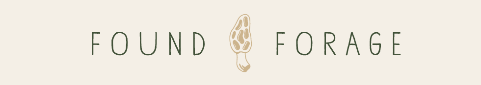
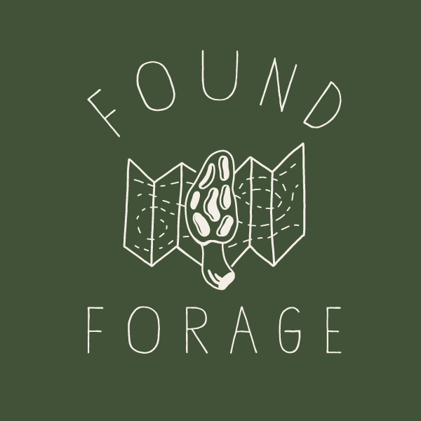

\*This app is styled for mobile devices.

Can't remember where you found that patch of morels last spring? Want to save your favorite trail head location? Found Forage allows users to map their exact coordinates, add notes, images and categorize their finds.

Saved locations are viewable on the Finds page.

Show off your finds to friends on the Archive and Gallery pages.  

Intended for all foragers as a mapping tool. Not a forager? Use Found Forage to save your deer stand location, map the location of that shiny rock you found.       

##Full Stack application using the MEAN STACK, Google Maps API and the Filestack API.

\*FOUND FORAGE is not an identification tool.

